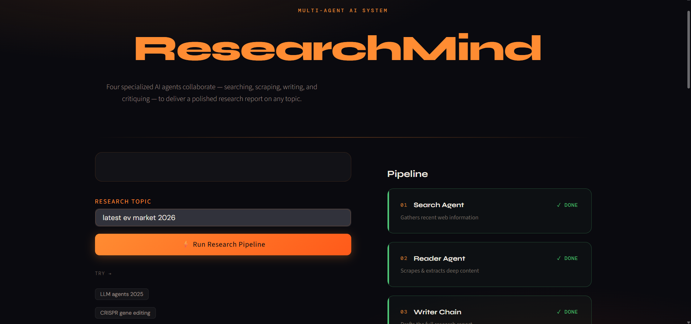

# ResearchMind: Multi-Agent AI Research System 🔬

ResearchMind is an advanced AI-powered research platform that leverages a collaborative multi-agent architecture to deliver deep, structured, and critiqued research reports on any topic.



## 🌟 Key Features

- **Multi-Agent Collaboration**: Four specialized agents (Search, Reader, Writer, and Critic) work together to ensure high-quality output.
- **Deep Web Scraping**: Unlike standard LLMs, ResearchMind scrapes real-time data from the web for up-to-date accuracy.
- **Automated Critique**: A built-in Critic agent reviews the draft and provides a quality score with improvement suggestions.
- **Modern UI**: A sleek, dark-themed Streamlit interface for a premium user experience.
- **CLI Support**: Run the full research pipeline directly from your terminal.

## 🤖 The Pipeline

1.  **Search Agent**: Identifies recent and reliable web sources related to the topic.
2.  **Reader Agent**: Scrapes the most relevant URLs for deep context extraction.
3.  **Writer Chain**: Synthesizes all gathered information into a structured research report.
4.  **Critic Chain**: Reviews the final report for depth, specificity, and source credibility.


## 🚀 Getting Started

### Prerequisites

- Python 3.10+
- API Keys for **Groq** and **Tavily** (or Serper)

### Installation

1.  **Clone the repository**:
    ```bash
    git clone https://github.com/RajkumarBR9789/multiple_AI_Agent.git
    cd multiple_AI_Agent
    ```

2.  **Create a virtual environment**:
    ```bash
    python -m venv venv
    source venv/bin/activate  # On Windows: venv\Scripts\activate
    ```

3.  **Install dependencies**:
    ```bash
    pip install -r requirements.txt
    ```

4.  **Set up environment variables**:
    Create a `.env` file in the root directory and add your API keys:
    ```env
    GROQ_API_KEY=your_groq_api_key
    TAVILY_API_KEY=your_tavily_api_key
    ```

### Running the Application

- **Web Interface (Streamlit)**:
  ```bash
  streamlit run app.py
  ```

- **CLI Mode**:
  ```bash
  python pipeline.py
  ```

## 🛠️ Tech Stack

- **Framework**: LangChain, LangGraph
- **LLM**: Groq (Llama 3 / Mixtral)
- **Search**: Tavily / Serper
- **UI**: Streamlit
- **Scraping**: BeautifulSoup4, Requests

## 📄 License

This project is licensed under the **MIT License** - see the [LICENSE](LICENSE) file for details.

---
Developed with ❤️ by [Rajkumar B R](https://github.com/RajkumarBR9789)
